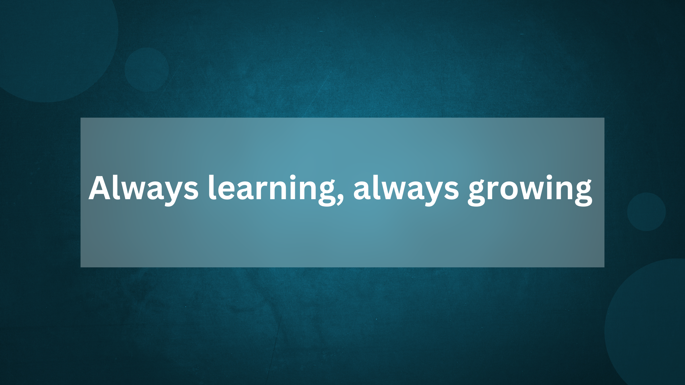

  

###

<h1 align="left">Hey 👋 What's going on?</h1>

###

<h2 align="left">My name is Juiena... I am  Front-End-Developer.</h2>

###

<h3 align="left">I’m a passionate Front-End Developer with a love for building user-friendly websites and exploring new technologies.</h3>

### 
My Recent Activities:
 ###
<ul align="left">
  <li>I am exploring NEXT.JS</li>
  <li>I also try to explore TypeScript</li>
  <li>After that, I will like to explore other stuff</li>
</ul>

<h2 align="left">I code with</h2>

###

  
  
  
  
  
  
  
  
  
  
  
  
  
  
  

###

✨ Creating bugs since ...2023 📚 I'm currently learning ...MongoDB database, Express.js 🎯 Goals: ...Full-Stack-Developer 🎲 Fun fact: ...I like to deal with errors

###
 <h3>Social <h3>
   

  
  
  
  

###

  
  
  

###
